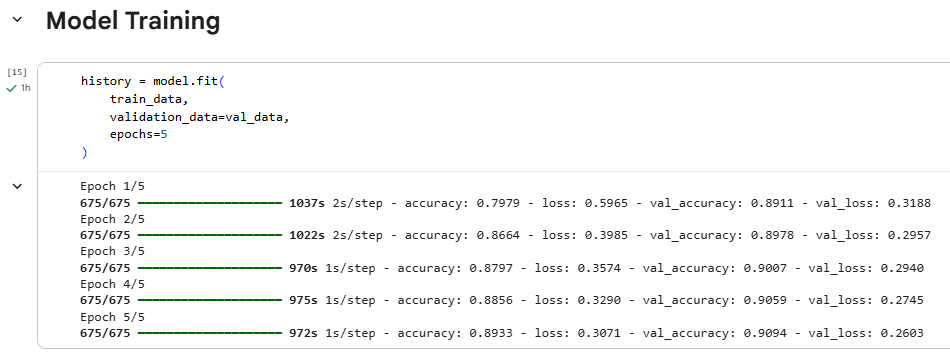
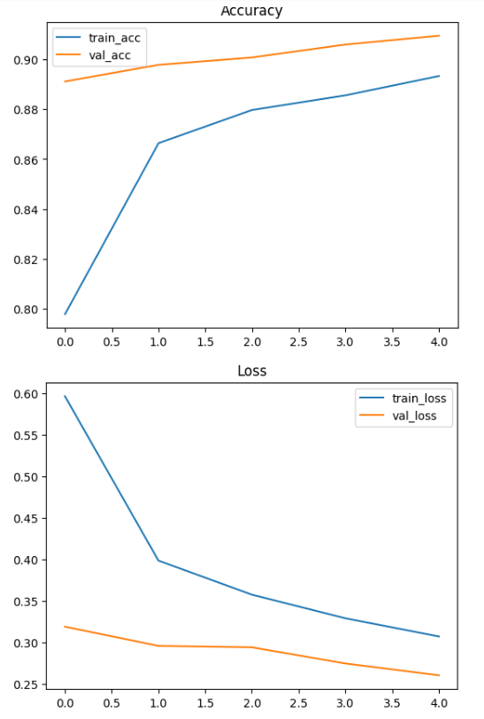
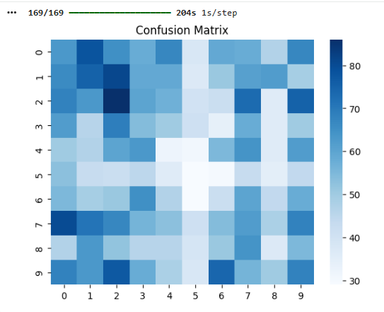
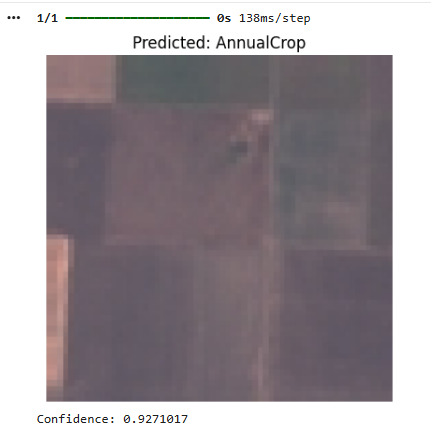
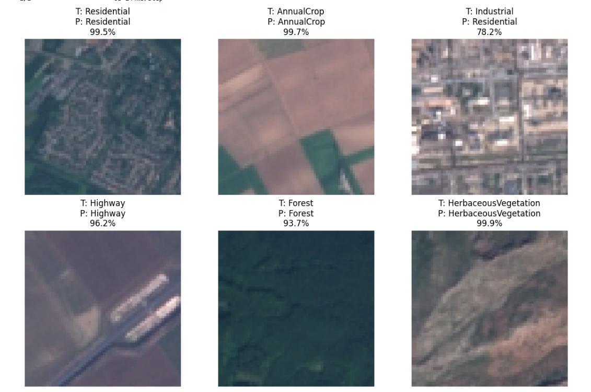
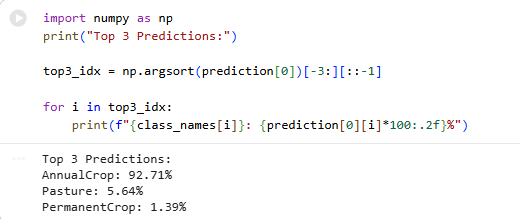

# Deep Learning for Satellite Image Classification (EuroSAT)

This project uses transfer learning (MobileNetV2) to classify satellite images into 10 land-use categories such as Forest, River, Residential, and Agricultural areas using the EuroSAT dataset.

---

## Key Features
- Transfer learning using MobileNetV2
- Achieved ~90% validation accuracy
- Prediction with confidence scores
- Top-3 class predictions
- Confusion matrix for evaluation
- Visualization of accuracy and loss

---

## Model Architecture
The model is based on MobileNetV2 pretrained on ImageNet, followed by a custom classification head consisting of:
- Global Average Pooling
- Dense layer (ReLU activation)
- Dropout for regularization
- Final Softmax layer for classification

---
  
## Results

### Accuracy & Loss

---

### Confusion Matrix

---

### Sample Prediction

---

## Multiple Predictions Visualization

The model is tested on multiple random satellite images to demonstrate its ability to generalize across different land-use categories. Each prediction includes the true label, predicted label, and confidence score.

---

### Top-3 Predictions

---

## Tech Stack
- Python
- TensorFlow / Keras
- NumPy
- Matplotlib
- Seaborn

---

## Dataset
EuroSAT Dataset – Satellite imagery dataset for land-use and land-cover classification.

---

## Project Highlights
- Implemented deep learning model for satellite image classification
- Applied transfer learning using MobileNetV2
- Achieved strong performance with minimal training time
- Demonstrated real-world application in remote sensing and geospatial analysis

---

## Author
- Revanth Reddy Bommala
- saireddybommala2005@gmail.com
